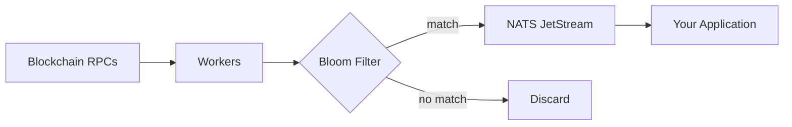
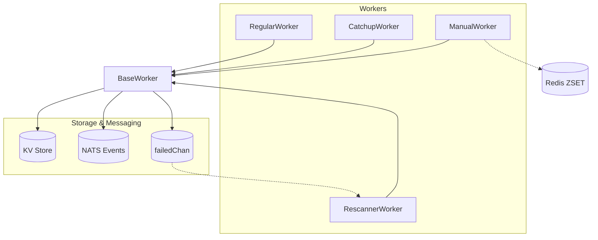

<div align="center">

# Multi-Chain Transaction Indexer

**Detect deposits to your addresses across 12+ blockchains in real time.**

A production-ready indexer that parses every on-chain transaction, matches destination addresses against your system via bloom filters, and streams matched transfers to NATS JetStream.


</div>

---

## Use Cases

- **Crypto Payment Gateways** — Detect incoming payments to merchant deposit addresses in real time across multiple chains. Automatically trigger order fulfillment or payment confirmation when funds arrive.
- **Centralized Exchanges (CEX)** — Monitor deposit addresses for incoming user funds. Identify and credit deposits across all supported chains without running separate infrastructure per network.
- **OTC Desks** — Track settlement addresses to confirm large transfers have landed on-chain. Get instant notifications when counterparty funds arrive at designated addresses.

## Key Features

- **12+ Chains** — Ethereum, BSC, TRON, Polygon, Arbitrum, Optimism, Bitcoin, Solana, Aptos, Sui, Cosmos, TON
- **Real-time + Historical** — Four cooperating workers cover live blocks, gap backfill, failed retries, and manual rescans
- **Bloom Filter Matching** — Sub-millisecond address lookups against millions of addresses with near-zero memory overhead
- **NATS JetStream Events** — Matched transactions streamed instantly for downstream processing
- **RPC Failover** — Automatic failover across multiple providers with rate limiting and exponential backoff
- **Restart-Safe** — All progress persisted to KV store; pick up exactly where you left off
- **Single Binary** — One Go binary indexes all chains concurrently, no external orchestration needed

## Architecture




<details>
<summary>Detailed worker architecture</summary>



</details>

## Performance

| Metric | Value |
| --- | --- |
| Address lookup (bloom filter) | < 1ms per check |
| Concurrent chains | Limited only by RPC capacity |
| Memory footprint | ~50 MB base + bloom filter |
| Recovery time | Instant — resumes from last persisted block |

## Why This Indexer?

| | This Indexer | The Graph | Alchemy Webhooks | Custom RPC Polling |
| --- | --- | --- | --- | --- |
| Self-hosted | Yes | Requires subgraph infra | No (SaaS) | Yes |
| Multi-chain in one binary | 12+ chains | Per-subgraph | Per-webhook | Manual per chain |
| Address filtering | Bloom filter (millions of addrs) | GraphQL queries | Webhook filters | Custom logic |
| Historical backfill | Built-in (catchup + manual workers) | Re-index subgraph | Limited | Manual |
| Latency | Block time (~1-12s) | Minutes (indexing delay) | Seconds | Block time |
| Cost | Infra only | Hosted fees or infra | Per-event pricing | Infra only |
| Non-EVM support | BTC, SOL, TRON, Aptos, Sui, Cosmos, TON | EVM only | EVM only | Per-chain effort |

## Supported Chains

| Chain | Type | Status |
| --- | --- | --- |
| Ethereum | EVM | Stable |
| BSC | EVM | Stable |
| Polygon | EVM | Stable |
| Arbitrum | EVM | Stable |
| Optimism | EVM | Stable |
| TRON | TRON | Stable |
| Bitcoin | UTXO | Stable |
| Solana | SVM | Beta |
| Aptos | Move | Beta |
| Sui | Move | Beta |
| Cosmos (Hub, Osmosis, Celestia) | Cosmos | Beta |
| TON | TON | Beta |
| XRP | XRP Ledger | Beta |
| Stellar | Stellar | Beta |

---

## Table of Contents

- [Quick Start](#-quick-start)
- [Worker Logic](#%EF%B8%8F-worker-logic)
- [KVStore / Redis Keys](#%EF%B8%8F-kvstore--redis-keys)
- [Prerequisites](#-prerequisites)
- [Configuration](#-configuration)
- [Usage Highlights](#-usage-highlights)
- [Consuming Transaction Events](#-consuming-transaction-events)
- [Contributing](#contributing)
- [License](#license)

---

**Logic Flow:**

1. **RegularWorker**: real-time indexing, reorg handling, error reporting
2. **CatchupWorker**: backfills gaps, tracks progress, cleans up ranges
3. **ManualWorker**: consumes Redis ranges, concurrent-safe backfill
4. **RescannerWorker**: retries failed blocks, updates KV on success

---

## Quick Start

```bash
git clone https://github.com/fystack/multichain-indexer.git
cd transaction-indexer
go mod download
cp configs/config.example.yaml configs/config.yaml
go build -o indexer cmd/indexer/main.go

# Index EVM & TRON in real-time
./indexer index --chains=ethereum_mainnet,tron_mainnet

# Add catchup worker for historical gaps
./indexer index --chains=ethereum_mainnet,tron_mainnet --catchup

# Add manual worker for missing blocks
./indexer index --chains=ethereum_mainnet,tron_mainnet --manual

# For help
./indexer --help
```

---

## ⚙️ Worker Logic

### **BaseWorker**

- Shared logic for all worker types
- Rate limiting, logging, bloom filter, KV store integration, infrastructure management
- Sends error blocks to `failedChan` and stores in `<chain>/failed_blocks/<block>`

---

### **RegularWorker**

- Continuously processes latest blocks from RPC
- Saves progress to `<chain>/latest_block`
- For EVM, handle reorgs with rollback window
- On block failure → BaseWorker stores it for retry

---

### **CatchupWorker**

- Processes historical blocks in ranges `[start,end]`
- Uses KV `<chain>/catchup_progress/<start>-<end>` to track progress
- Deletes the key when a range is completed
- Integrates failed blocks from Rescanner

---

### **ManualWorker**

- Handles **explicit missing blocks** (due to RPC errors, reorg skips, or manual intervention).
- Missing ranges are stored in **Redis ZSET**:

  - Member format: `"start-end"`
  - Score = `start` (to sort ranges by block number)
  - Large ranges split into small ranges (default 5 blocks) for finer retries

- **Concurrency-safe with Redis locks** (`SETNX + EX` via Lua)
- Workflow:

  1. Claim unprocessed range (`GetNextRange`)
  2. Process all blocks in `[start,end]`
  3. Update progress with `SetRangeProcessed`
  4. On full success → `RemoveRange`
  5. On partial timeout → reinsert remaining `[current,end]`

---

### **RescannerWorker**

- Re-processes failed blocks from KV `<chain>/failed_blocks/<block>` or `failedChan`
- Updates KV when retry succeeds
- Removes blocks after max retry attempts
- Skips chain head block to reduce reorg risk

---

## 🗝️ KVStore / Redis Keys

| Key                                      | Purpose                             |
| ---------------------------------------- | ----------------------------------- |
| `<chain>/latest_block`                   | RegularWorker progress              |
| `<chain>/catchup_progress/<start>-<end>` | CatchupWorker progress per range    |
| `<chain>/failed_blocks/<block>`          | Failed blocks metadata for retry    |
| `<chain_type>/<address>`                 | Public key store                    |
| `missing_blocks:<chain>`                 | Redis ZSET of missing ranges        |
| `processing:<chain>:<start>-<end>`       | Redis lock key for concurrent claim |
| `processed:<chain>:<start>-<end>`        | Last processed block in range       |

---

## ✅ Prerequisites

Start required services before running the indexer (docker-compose provided):

- NATS server (events)
- Consul (KV) or Badger (embedded)
- PostgreSQL (wallet address repo)
- Redis (for Bloom filter or ManualWorker)

```bash
docker-compose up -d
```

---

## 🔧 Configuration

- **Chains**: configurable (`start_block`, `batch_size`, `poll_interval`)
- **KVStore**: BadgerDB / in-memory / Consul
- **Bloom Filter**: Redis or in-memory
- **Event Emitter**: NATS streaming
- **RPC Providers**: failover + rate-limiting

See `configs/config.example.yaml` for details.

---

## 🏗️ Core Principles

- **Multi-chain support**: independent workers per chain
- **Auto-catchup**: detect gaps → backfill → cleanup
- **Failed block recovery**: persisted + retryable
- **Manual backfill**: Redis-driven, safe for concurrency
- **State persistence**: KV + BlockStore → restart-safe

---

## ⚡ Usage Highlights

The chain names passed to `--chains` **must match the names defined in `configs/config.yaml`**.
Example: `ethereum_mainnet`, `tron_mainnet`.

```bash
# Real-time only
./indexer index --chains=ethereum_mainnet,tron_mainnet

# Real-time + catchup (fill historical gaps)
./indexer index --chains=ethereum_mainnet,tron_mainnet --catchup

# Add manual worker to process missing blocks from Redis
./indexer index --chains=ethereum_mainnet,tron_mainnet --manual

# Debug mode (extra logs)
./indexer index --chains=ethereum_mainnet,tron_mainnet --debug

# NATS JetStream transaction monitoring (using NATS CLI)
nats stream add transfer --subjects="transfer.event.*" --storage=file --retention=workqueue
nats consumer add transfer transaction-consumer --filter="transfer.event.dispatch" --deliver=all --ack=explicit
nats consumer sub transfer transaction-consumer

# Initialize bloom filter and kvstore
./wallet-kv-load run --config configs/config.yaml --batch 10000 --debug

# Migrate from Badger to Consul (edit migrate.yaml first)
./kv-migrate run --config configs/config.yaml --dry-run
```

---

## 📝 Example `configs/config.yaml` (chains section)

```yaml
chains:
  ethereum_mainnet: # <- this is the chain name
    type: "evm"
    nodes:
      - url: "https://eth-mainnet.g.alchemy.com/v2/${API_KEY}"
        auth:
          type: "header"
          key: "Authorization"
          value: "Bearer ${API_KEY}"
      - url: "https://rpc.ankr.com/eth"
    start_block: 21500000
    poll_interval: "6s"
    client:
      timeout: "20s"
      max_retries: 3
      retry_delay: "5s"
      throttle:
        rps: 8
        burst: 16

  tron_mainnet:
    type: "tron"
    nodes:
      - url: "https://api.trongrid.io"
        auth:
          type: "header"
          key: "TRON-PRO-API-KEY"
          value: "${TRON_API_KEY}"
      - url: "https://tron-rpc.publicnode.com"
    start_block: 75144237
    poll_interval: "8s"
    client:
      timeout: "20s"
      max_retries: 5
      retry_delay: "10s"
      throttle:
        rps: 5
        burst: 8

  cosmoshub_mainnet:
    type: "cosmos"
    network_id: "cosmoshub-4"
    native_denom: "uatom"
    nodes:
      - url: "https://rpc.cosmos.directory/cosmoshub"
      - url: "https://cosmos-rpc.publicnode.com"
    poll_interval: "5s"
    client:
      timeout: "20s"
      max_retries: 3
      retry_delay: "2s"
    throttle:
      rps: 20
      burst: 40
```

## 📡 Consuming Transaction Events

The indexer publishes transaction events to NATS JetStream. Here's how to consume them:

### NATS JetStream Configuration

- **Stream Name**: `transfer`
- **Subjects**: `transfer.event.*`
- **Transaction Topic**: `transfer.event.dispatch`
- **Storage**: FileStorage with WorkQueue retention policy

### Using NATS CLI

```bash
# Create stream (if not exists)
nats stream add transfer --subjects="transfer.event.*" --storage=file --retention=workqueue

# Create consumer
nats consumer add transfer my-consumer --filter="transfer.event.dispatch" --deliver=all --ack=explicit

# Consume transactions
nats consumer sub transfer my-consumer

# Get stream info
nats stream info transfer
```

### Sample Transfer Events

Each message published to NATS contains a single transaction serialized as JSON.

**EVM Native Transfer (ETH):**

```json
{
  "txHash": "0x8a5c1b3e9f2d4a6b7c0e1f3d5a7b9c2e4f6a8d0b3c5e7f9a1b3d5f7a9c1e3f",
  "networkId": "ethereum_mainnet",
  "blockNumber": 21500150,
  "fromAddress": "0x742d35Cc6634C0532925a3b844Bc9e7595f2bD18",
  "toAddress": "0x5aAeb6053F3E94C9b9A09f33669435E7Ef1BeAed",
  "assetAddress": "",
  "amount": "1500000000000000000",
  "type": "native_transfer",
  "txFee": "0.000315",
  "timestamp": 1704067200
}
```

**EVM Token Transfer (ERC-20 USDT):**

```json
{
  "txHash": "0x1b2c3d4e5f6a7b8c9d0e1f2a3b4c5d6e7f8a9b0c1d2e3f4a5b6c7d8e9f0a1b",
  "networkId": "ethereum_mainnet",
  "blockNumber": 21500200,
  "fromAddress": "0xA1b2C3d4E5f6789abcdef0123456789ABCDEF01",
  "toAddress": "0xF1e2D3c4B5a6978654321fedcba9876543210FED",
  "assetAddress": "0xdAC17F958D2ee523a2206206994597C13D831ec7",
  "amount": "50000000",
  "type": "token_transfer",
  "txFee": "0.00042",
  "timestamp": 1704067800
}
```

**TRON Native Transfer (TRX):**

```json
{
  "txHash": "a1b2c3d4e5f6a7b8c9d0e1f2a3b4c5d6e7f8a9b0c1d2e3f4a5b6c7d8e9f0a1b2",
  "networkId": "tron_mainnet",
  "blockNumber": 75144300,
  "fromAddress": "TJYeasTPa3GwE8Rrk2DLJ9RVmPEBsXcZnH",
  "toAddress": "TVj35JkE8NNohMGjhYhD47Rk3KLBQvSfbx",
  "assetAddress": "",
  "amount": "10000000",
  "type": "native_transfer",
  "txFee": "1.1",
  "timestamp": 1704068400
}
```

**Solana Token Transfer (SPL USDC):**

```json
{
  "txHash": "5KtPn1LGuxhFiwjxErkxTb5dTmJmx8bLmQrXUpwZhfJzNFyRHNLFpA8yrJcdminZ",
  "networkId": "solana_mainnet",
  "blockNumber": 312000500,
  "fromAddress": "9WzDXwBbmkg8ZTbNMqUxvQRAyrZzDsGYdLVL9zYtAWWM",
  "toAddress": "7xKXtg2CW87d97TXJSDpbD5jBkheTqA83TZRuJosgAsU",
  "assetAddress": "EPjFWdd5AufqSSqeM2qN1xzybapC8G4wEGGkZwyTDt1v",
  "amount": "1000000",
  "type": "token_transfer",
  "txFee": "0.000005",
  "timestamp": 1704069000
}
```

**Sui Native Transfer (SUI):**

```json
{
  "txHash": "3Fz8wLkMnPqRsT2uVxY4zA1bC5dE7fG9hI0jK3lM5nO",
  "networkId": "sui_mainnet",
  "blockNumber": 48500100,
  "fromAddress": "0x1a2b3c4d5e6f7890abcdef1234567890abcdef1234567890abcdef1234567890",
  "toAddress": "0xfedcba0987654321fedcba0987654321fedcba0987654321fedcba0987654321",
  "assetAddress": "0x2::sui::SUI",
  "amount": "2000000000",
  "type": "native_transfer",
  "txFee": "0.001",
  "timestamp": 1704069600
}
```

**Bitcoin Native Transfer (BTC):**

```json
{
  "txHash": "a1b2c3d4e5f6a7b8c9d0e1f2a3b4c5d6e7f8a9b0c1d2e3f4a5b6c7d8e9f0a1b2",
  "networkId": "bitcoin_mainnet",
  "blockNumber": 850100,
  "fromAddress": "bc1qxy2kgdygjrsqtzq2n0yrf2493p83kkfjhx0wlh",
  "toAddress": "bc1q9h5yjqka3g4fs3pwfmwqf5ye9h6ynxz0s7ywyx",
  "assetAddress": "",
  "amount": "50000",
  "type": "native_transfer",
  "txFee": "0.00001234",
  "timestamp": 1704070200
}
```

**Field Reference:**

| Field | Description |
| --- | --- |
| `txHash` | Transaction hash |
| `networkId` | Chain identifier matching config name |
| `blockNumber` | Block height (0 for mempool) |
| `fromAddress` | Sender address |
| `toAddress` | Recipient address |
| `assetAddress` | Token contract address (empty for native transfers) |
| `amount` | Transfer amount in smallest unit (wei, sun, lamports, etc.) |
| `type` | `native_transfer` or `token_transfer` |
| `txFee` | Transaction fee in native token |
| `timestamp` | Unix timestamp |

### Important: Bloom Filter and Event Verification

> **Warning:** The bloom filter used for address filtering is a **probabilistic data structure**. It guarantees that if an address is *not* in the filter, it will never match (no false negatives), but it *may* occasionally produce **false positives** — meaning you could receive events for addresses that are not actually in your system.
>
> When consuming transaction events, **always verify that the destination address (`toAddress`) exists in your system before crediting your ledger.** Do not blindly trust bloom filter matches for financial operations.

### Using Go JetStream Client

```go
package main

import (
    "context"
    "log"
    "github.com/nats-io/nats.go"
    "github.com/nats-io/nats.go/jetstream"
)

func main() {
    nc, _ := nats.Connect("nats://localhost:4222")
    defer nc.Close()

    js, _ := jetstream.New(nc)

    // Create or get consumer filtered to transfer.event.dispatch
    consumer, _ := js.CreateOrUpdateConsumer(context.Background(), "transfer", jetstream.ConsumerConfig{
        Name:           "my-consumer",
        Durable:        "my-consumer",
        FilterSubjects: []string{"transfer.event.dispatch"},
        MaxDeliver:     3,
    })

    // Consume messages
    consumer.Consume(func(msg jetstream.Msg) {
        log.Printf("Transaction: %s", string(msg.Data()))
        msg.Ack()
    })

    select {} // Keep running
}
```

---

## Contributing

Contributions are welcome! Please see [CONTRIBUTING.md](CONTRIBUTING.md) for guidelines.

1. Fork the repository
2. Create your feature branch (`git checkout -b feat/my-feature`)
3. Commit your changes (`git commit -m 'feat: add my feature'`)
4. Push to the branch (`git push origin feat/my-feature`)
5. Open a Pull Request

## License

This project is licensed under the MIT License. See [LICENSE](LICENSE) for details.
